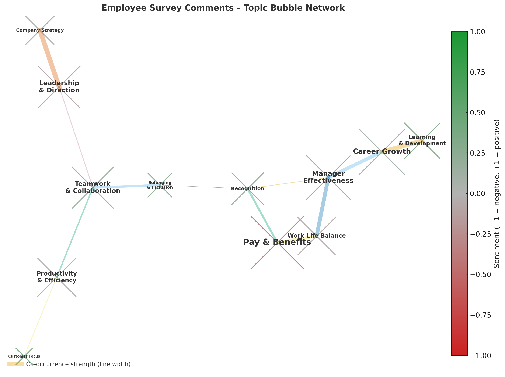

# Employee Survey Bubble Network (Streamlit)

A replicable "employee listening" visualization that turns qualitative survey comments into a bubble network. Each node represents a taxonomy topic, node size encodes comment volume, color tracks average sentiment, and weighted edges highlight co-occurring themes.

## Included Assets

- `streamlit_app.py` – Streamlit + NetworkX app for editing data, tuning layout controls, and rendering the network in real time.
- `topics_sample.csv` – Topic catalogue with volumes, sentiment scores, and high-level themes.
- `edges_sample.csv` – Pairwise topic co-occurrence weights used to draw edges.
- `employee_topics_bubble_graph.png` – Example graph output for quick reference in decks.

All files live beside this note so they can be referenced directly by MkDocs or other doc tooling.

## Sample Data Files

### topics_sample.csv
```csv
topic,volume,sentiment,theme
Career Growth,820,0.1,Development
Pay & Benefits,990,-0.35,Rewards
Work-Life Balance,620,-0.05,Wellbeing
Leadership & Direction,720,-0.1,Strategy
Company Strategy,450,0.05,Strategy
Recognition,510,0.2,Culture
Manager Effectiveness,760,-0.15,Leadership
Learning & Development,580,0.3,Development
Belonging & Inclusion,390,0.25,Culture
Productivity & Efficiency,640,0.05,Operations
Teamwork & Collaboration,700,0.15,Culture
Customer Focus,300,0.35,Operations
```

### edges_sample.csv
```csv
source,target,weight
Career Growth,Learning & Development,210
Career Growth,Manager Effectiveness,180
Pay & Benefits,Recognition,130
Pay & Benefits,Work-Life Balance,160
Work-Life Balance,Manager Effectiveness,190
Leadership & Direction,Company Strategy,220
Leadership & Direction,Teamwork & Collaboration,95
Teamwork & Collaboration,Belonging & Inclusion,140
Productivity & Efficiency,Teamwork & Collaboration,110
Productivity & Efficiency,Customer Focus,90
Recognition,Belonging & Inclusion,75
Manager Effectiveness,Recognition,85
```

## Streamlit Application

```python
import pandas as pd
import numpy as np
import matplotlib.pyplot as plt
import networkx as nx
from matplotlib.colors import LinearSegmentedColormap, Normalize
from matplotlib.cm import ScalarMappable

import streamlit as st

st.set_page_config(page_title="Employee Topic Bubble Network", layout="wide")
st.title("Employee Survey – Topic Bubble Network")

st.markdown("Upload or edit the CSVs below to change taxonomy, volumes, sentiments, and co-occurrence strengths.")

# Load data
topics_df = pd.read_csv("topics_sample.csv")
edges_df = pd.read_csv("edges_sample.csv")

# Sidebar controls
st.sidebar.header("Controls")
min_area = st.sidebar.slider("Min bubble area", 200, 3000, 800, 50)
max_area = st.sidebar.slider("Max bubble area", 3000, 15000, 8000, 50)
min_w = st.sidebar.slider("Min edge width", 0.1, 5.0, 0.5, 0.1)
max_w = st.sidebar.slider("Max edge width", 2.0, 20.0, 8.0, 0.5)
seed = st.sidebar.number_input("Layout seed", value=42, step=1)

# Enable editing in-place (Streamlit's data editor)
st.subheader("Topics")
topics_df = st.data_editor(topics_df, num_rows="dynamic", use_container_width=True)
st.subheader("Edges")
edges_df = st.data_editor(edges_df, num_rows="dynamic", use_container_width=True)

# Build graph
G = nx.Graph()
for _, r in topics_df.iterrows():
    G.add_node(r["topic"], volume=float(r["volume"]), sentiment=float(r["sentiment"]), theme=str(r.get("theme", "")))
for _, r in edges_df.iterrows():
    if r["source"] in G.nodes and r["target"] in G.nodes:
        G.add_edge(r["source"], r["target"], weight=float(r["weight"]))

pos = nx.spring_layout(G, seed=int(seed), k=None)

# Scale encodings
volumes = np.array([G.nodes[n]["volume"] for n in G.nodes])
vmin, vmax = volumes.min() if len(volumes) else 0, volumes.max() if len(volumes) else 1
areas = min_area + (volumes - vmin) / (vmax - vmin + 1e-9) * (max_area - min_area)

sentiments = np.array([G.nodes[n]["sentiment"] for n in G.nodes])
colors_neg = (0.80, 0.13, 0.13)
colors_neu = (0.70, 0.70, 0.70)
colors_pos = (0.10, 0.60, 0.20)
cmap = LinearSegmentedColormap.from_list("sentiment_map", [colors_neg, colors_neu, colors_pos])
norm = Normalize(vmin=-1, vmax=1)

edge_weights = np.array([G.edges[e]["weight"] for e in G.edges]) if len(G.edges) else np.array([0.0])
ew_min, ew_max = edge_weights.min(), edge_weights.max()
edge_widths = min_w + (edge_weights - ew_min) / (ew_max - ew_min + 1e-9) * (max_w - min_w)

# Plot
fig = plt.figure(figsize=(12, 9))

# Edges
if len(G.edges) > 0:
    for (edge, w) in zip(G.edges, edge_widths):
        n1, n2 = edge
        x1, y1 = pos[n1]
        x2, y2 = pos[n2]
        plt.plot([x1, x2], [y1, y2], linewidth=w, alpha=0.35)

# Nodes
node_xy = np.array([pos[n] for n in G.nodes])
plt.scatter(node_xy[:, 0], node_xy[:, 1], s=areas, c=sentiments, cmap=cmap, norm=norm, alpha=0.95, edgecolors="white", linewidths=1.5)

# Labels
min_area_local, max_area_local = min_area, max_area
for (n, (x, y), a) in zip(G.nodes, node_xy, areas):
    fs = 6 + (a - min_area_local) / (max_area_local - min_area_local + 1e-9) * 8
    label = n
    if len(label) > 18 and " " in label:
        parts = label.split(" ")
        mid = len(parts) // 2
        label = " ".join(parts[:mid]) + "\n" + " ".join(parts[mid:])
    plt.text(x, y, label, ha="center", va="center", fontsize=fs, weight="bold")

plt.title("Employee Survey Comments – Topic Bubble Network")
plt.axis("off")

sm = ScalarMappable(cmap=cmap, norm=norm)
sm.set_array([])
cb = plt.colorbar(sm, fraction=0.035, pad=0.02)
cb.set_label("Sentiment (−1 to +1)")

st.pyplot(fig)

# Download updated CSVs
st.download_button("Download topics CSV", data=topics_df.to_csv(index=False), file_name="topics_updated.csv", mime="text/csv")
st.download_button("Download edges CSV", data=edges_df.to_csv(index=False), file_name="edges_updated.csv", mime="text/csv")
```

## Running Locally

```bash
pip install streamlit pandas numpy matplotlib networkx
streamlit run streamlit_app.py
```

Adjust bubble/edge scaling in the sidebar while editing the CSV tables inline, then use the download buttons to export cleaned datasets.

## Sample Bubble Graph


